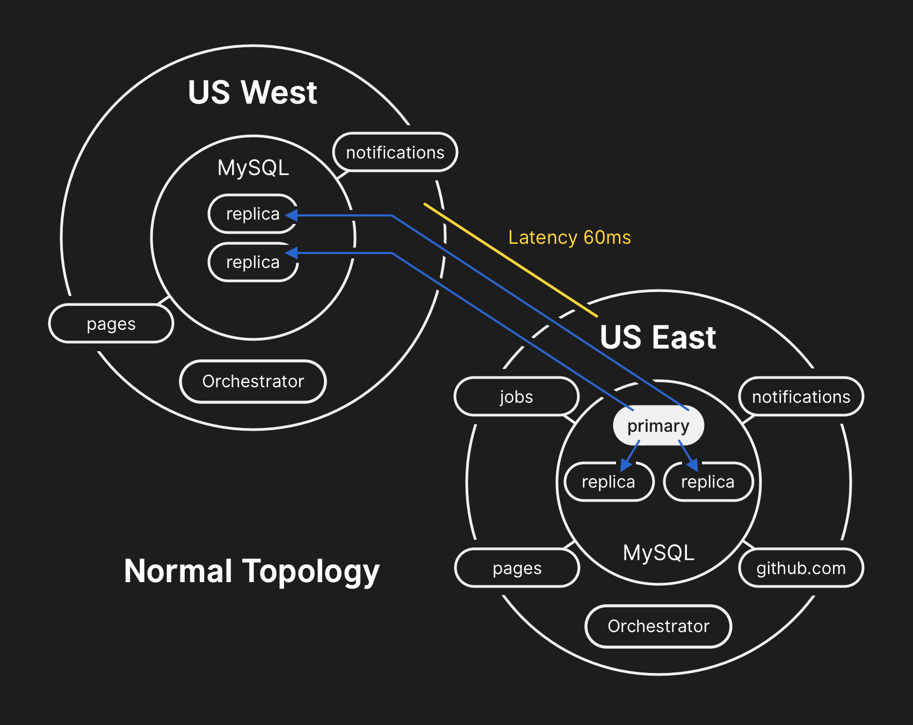
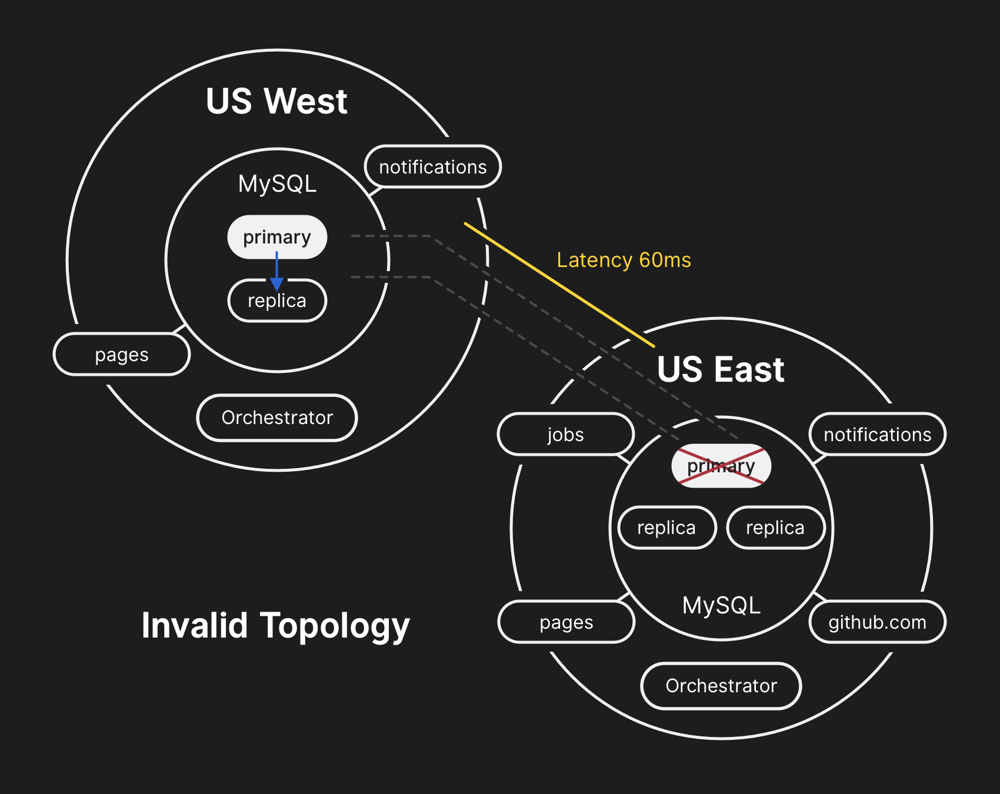
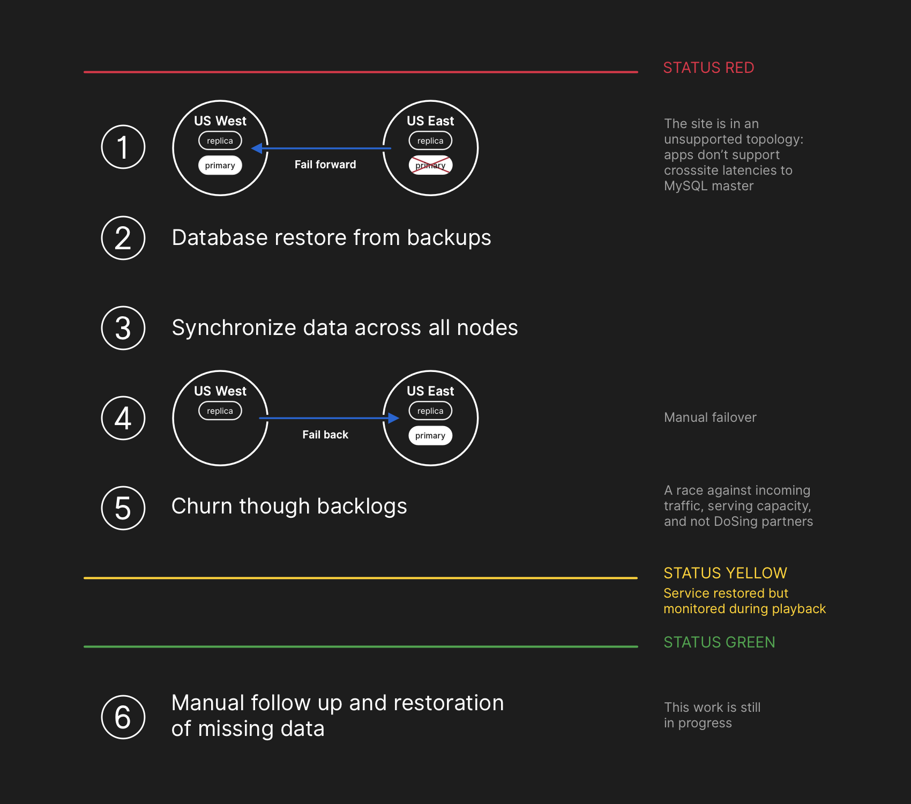

# Домашнее задание к занятию 17 «Инцидент-менеджмент»

## Задание

Составьте постмортем на основе реального сбоя системы GitHub в 2018 году.

Информацию о сбое можно изучить по ссылкам ниже:

* [краткое описание на русском языке](https://habr.com/ru/post/427301/);
* [развёрнутое описание на английском языке](https://github.blog/2018-10-30-oct21-post-incident-analysis/).

Используем примерный план :  

краткое описание инцидента  
предшествующие события  
причина инцидента  
воздействие  
обнаружение  
реакция  
восстановление  
таймлайн  
последующие действия  

------------

## Краткое описание инцидента :   
21 октября 2021 г. , В результате кратковременной потерисвязи между двумя ЦОД GitHub столкнулся с масштабным  инцидентном, который привел к появлению непоследовательной информации на веб-сайте GitHub.com.  
Данные пользователей и бд не пострадали , но потребовалось около 24 часов чтобы система вернулсь в норму.  

## Предшествующие события :  
замена оптического оборудования в рамках технического обслуживания  
  
## Беграунд :  
Большая часть сервисов GitHub работают в собственных ЦОД.  
Для улучшение производительности при масштабировании , используется оркестратор , управляющий топологией кластеров и соединениями.  

  
## Причина инцидента :  
Во время замены оптического обрудования в ЦОД Восточного побережья возникла 43 секундная потеря связности  между цодами Восточного и Западного побережья.  
В результате чего Оркестратор переместил первичный кластер баз данных на Западное побережье. В следствии этого значительно увеличились задержки при записи данных , что в итоге, привело к несогласованности отображаемой на сайте информации  

причина  

## Воздействие :  
не отображались внесенные пользвателями issue и комментарии  
не работали вебхуки   
отображаемые данные могли быть непоследовательными или устаревшими  
  
  
## Обнаружение :  
2018 Октбяря в 21 22:54 UTC , системы мониторинга начали регистрировать многочисленные ошибки. Дежурные инженеры приступили к разбору ситуации. В 23:02 причина была обнаружена.  
  
## Реакция :  
чтобы предотвратить дальнейшее внесени несогласованных данных инженеры заблокировали все внесение изменений.  
Было принято решение вручную восстановить кластер БД в ЦОД Восточного побережья и переключить операции на него.  

## Восстановление :  
В результате ручного восстановления кластера Восточного побережья и согласования всех данных, сайт вернулся в работу в режиме полной фунциональности, запросы висевшие в очереди были обработаны и полная функциональность была восстановлена.  
работы заняли 24 часа и 11 минут  

план восстановления  

таймлайн  
*   2018 October 21 22:52 UTC : Во время технических работ в ЦОД Восточного побережья пропадает связь на 43 секунды. 
*   2018 October 21 22:54 UTC : Система мониторинга регистрирует ошибки. Дежурные инжинеры начинают разбор ситуации  
*   2018 October 21 23:02 UTC : Становится понятно что причина в несогласованности данных  
*   2018 October 21 23:07 UTC : Проблема передается команде реагирования. В качестве контрмеры блокируется внесение изменений  
*   2018 October 21 23:13 UTC : Стало ясно, что причина в переносе Оркестратором приоритетноого кластера и возникшихв  результате несогласованностях. принято решению вручную восстановить кластер Восточного побережья и его топологию  
*   2018 October 21 23:19 UTC : Принято решение временно остановить прием пользовательских вебхуков и сборок, чтобы ускорить и облегчить восстановление и согласование данных  
*   2018 October 22 00:05 UTC : Команда реагирования начала работы по восстановлению и синхронизации данных  
*   2018 October 22 00:41 UTC : Восстановление началось  
*   2018 October 22 06:51 UTC : Часть кластера успешно восстановлена, началась репликация данных из Восточного побережья  
*   2018 October 22 11:12 UTC : Все приоритетные базы данных на Восточном побережье восстановлены. Идет репликация данных  
*   2018 October 22 16:24 UTC : Репликация данных завершена  
*   2018 October 22 16:45 UTC : Началась обработка вебхуков из беклога  
*   2018 October 22 23:03 UTC : Все вебхуки и билды из беклога обработаны и интегрированны  

Последующие действия :  
Инцидент позволил Githab определить слабые места в существовавшей системе обсепечения безотказности. В результете были пересмотрена организация и стратегии восстановления.    
принятые меры   :  
*	Оркестратор должен быть настроен так , чтобы не перемещать первичные кластеры БД за пределы региона  
*	Ускорена миграция на новую систему оповещения и расширению ее возможностей  
*   Стартовали проекты стимулирующие обеспечение автоматической отказоустойчивости без реакции пользователя , даже при выходе из строя одного из ЦОД   
*	Будут проводиться регулярные првоерки и тестирования систем, в целях повышения надежности  

